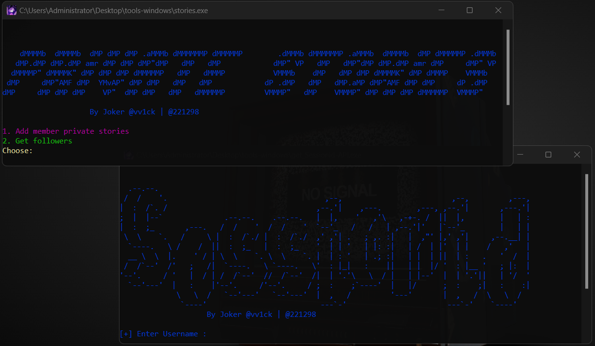

# Stories-IG

## YouTube Video

[](https://youtu.be/rMuSVyKENCc?si=q8vTmk1-4o1HO3mY)

<div align="center">
    <a href="https://instagram.com/221298">
        
    </a>
    <a href="https://t.me/vv3ck">
        
    </a>
</div>

Instagram story views booster tool , In the Instagram application, your story is not displayed to all your followers in the same way if the number of followers exceeds 1k followers, the tool adds all your followers in the Close Story (private story) to ensure that the story reaches all your followers, after adding all your followers in the private story, post anything in the story and when you are done, post a story in the private story so that your stories appear to all your followers.

## Usage explanation
First, download the tools. If you are using Windows, you will find a folder called tools-windows, which contains the tools in EXE format.
> If you are using a system other than Windows, you will find the tools in py format. Run them in a code editor that supports Python or via the terminal, but make sure that you have downloaded Python and installed all the libraries.
- 1 Run the get_Sessionid-API tool and log in with a fake Instagram account or one you don't need.
- 2 The account session will be extracted, it will be saved in the sessionids.txt file, open the file and you will find Sessionid API 1 and Sessionid API 2, we need Sessionid API 2, copy it 
- 3 Now you will be asked for the Sessionid API 2, enter it.
- 4 Now run the stories tool and enter number 2, you will be asked for a username. Enter your username on Instagram.
- 5 The followers will be extracted and saved in the users-ID.txt file. After completion, run the get_Sessionid-API tool again and log in with your official account, not your fake account.
- 6 After logging in and extracting the session, do as you did before. Copy the new Sessionid API 2 for your real account and run the stories tool again.
- 7 Select number 1 in the stories tool and enter the session you extracted and all your followers will be added to the private story

## Supported Systems

| System     | Supported |
|------------|-----------|
| Kali Linux | ✅         |
| Windows    | ✅         |
| Android    | ✅         |
| iOS        | ✅         |

You will find the tool in exe format for direct use on Windows and also find its source code 🖥 if you want to run it on your phone 🥬 or Kali Linux 🖥.

## Installation on Kali Linux

1. **Download the resource:**

    ```sh
    sudo git clone https://github.com/vv1ck/Stories-IG
    ```

2. **Go to the folder:**

    ```sh
    cd Stories-IG
    ```

3. **Run (tests):**

    ```sh
    python3 get_Sessionid-API.py
    python3 stories.py
    ```

## Note

- The fake account may be banned and the session may be cut during the process of extracting followers, you will be asked for a new session. You have run the get_Sessionid-API tool.
> python3 get_Sessionid-API.py
- Put it in the stories tool to complete extracting followers without re-extracting from the beginning


**By Joker, IG: @221298**

[//]: # (These are reference links used in the body of this note and get stripped out when the markdown processor does its job. There is no need to format nicely because it shouldn't be seen. Thanks SO - http://stackoverflow.com/questions/4823468/store-comments-in-markdown-syntax)

   [dill]: <https://github.com/joemccann/dillinger>
   [git-repo-url]: <https://github.com/joemccann/dillinger.git>
   [john gruber]: <http://daringfireball.net>
   [df1]: <http://daringfireball.net/projects/markdown/>
   [markdown-it]: <https://github.com/markdown-it/markdown-it>
   [Ace Editor]: <http://ace.ajax.org>
   [node.js]: <http://nodejs.org>
   [Twitter Bootstrap]: <http://twitter.github.com/bootstrap/>
   [jQuery]: <http://jquery.com>
   [@tjholowaychuk]: <http://twitter.com/tjholowaychuk>
   [express]: <http://expressjs.com>
   [AngularJS]: <http://angularjs.org>
   [Gulp]: <http://gulpjs.com>

   [PlDb]: <https://github.com/joemccann/dillinger/tree/master/plugins/dropbox/README.md>
   [PlGh]: <https://github.com/joemccann/dillinger/tree/master/plugins/github/README.md>
   [PlGd]: <https://github.com/joemccann/dillinger/tree/master/plugins/googledrive/README.md>
   [PlOd]: <https://github.com/joemccann/dillinger/tree/master/plugins/onedrive/README.md>
   [PlMe]: <https://github.com/joemccann/dillinger/tree/master/plugins/medium/README.md>
   [PlGa]: <https://github.com/RahulHP/dillinger/blob/master/plugins/googleanalytics/README.md>
